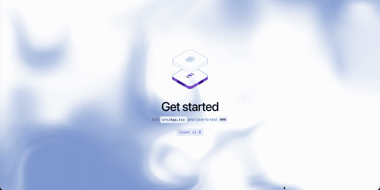

# Deepseek Background

一个基于 WebGL 2 的交互式流体渐变背景组件。背景会随鼠标移动产生柔和扰动，并持续生成缓慢流动的抽象纹理。

提供 Vue 2、Vue 3、React 和原生 JavaScript 版本；不依赖第三方运行时库。

## 效果预览



> 需要支持 WebGL 2 的现代浏览器。触屏设备会保留动态背景，但不启用鼠标交互。

## 文件说明

| 文件 | 用途 |
| --- | --- |
| `background-core.js` | WebGL 渲染核心，可传入自定义参数 |
| `BackgroundVue2.vue` | Vue 2 组件 |
| `BackgroundVue3.vue` | Vue 3 组件 |
| `Background.tsx` | React 组件 |
| `BackgroundVanilla.js` | 原生 JavaScript 挂载函数 |
| `background-core.d.ts` | 核心函数的 TypeScript 类型声明 |

## 快速开始

将所需文件复制到项目中，并确保组件所在容器有明确高度。画布作为背景层时，建议使用以下全局样式：

```css
.background-canvas {
  position: fixed;
  inset: 0;
  z-index: -1;
  width: 100%;
  height: 100%;
  pointer-events: none;
}
```

如果背景只应覆盖某一块区域，将 `position` 改为 `absolute`，并为父元素设置 `position: relative` 与合适高度。

### Vue 3

复制 `BackgroundVue3.vue`、`background-core.js` 到项目后：

```vue
<script setup>
import Background from './components/BackgroundVue3.vue'
</script>

<template>
  <Background />
  <main>
    <!-- 页面内容 -->
  </main>
</template>
```

### Vue 2

```vue
<script>
import Background from './components/BackgroundVue2.vue'

export default {
  components: { Background },
}
</script>

<template>
  <div>
    <Background />
    <main><!-- 页面内容 --></main>
  </div>
</template>
```

### React

复制 `Background.tsx`、`background-core.js` 到项目后：

```tsx
import { Background } from './components/Background'

export default function App() {
  return (
    <>
      <Background />
      <main>{/* Page content */}</main>
    </>
  )
}
```

### 原生 JavaScript

```html
<main>
  <!-- 页面内容 -->
</main>

<script type="module">
  import { createBackground } from './BackgroundVanilla.js'

  const dispose = createBackground()

  // 在单页应用路由切换或页面销毁时执行。
  // dispose()
</script>
```

也可以将画布限制在指定容器内：

```js
const hero = document.querySelector('.hero')
const dispose = createBackground(hero)
```

## 自定义效果

直接使用核心函数即可传入参数。返回的函数用于停止动画、移除事件监听并释放 WebGL 资源。

```js
import { mountBackground } from './background-core.js'

const canvas = document.querySelector('.background-canvas')
const dispose = mountBackground(canvas, {
  color1: '#5573B7',
  color2: '#DCE7FF',
  color3: '#FFFFFF',
  speed: 20,
  distortion: 28,
  swirl: 16,
  mouseStrength: 1.4,
})
```

| 参数 | 默认值 | 说明 |
| --- | ---: | --- |
| `color1` / `color2` / `color3` | `#8AA3D6` / `#FFFFFF` / `#FFFFFF` | 三个六位十六进制颜色 |
| `speed` | `14` | 动画速度 |
| `scale` | `0.5` | 纹理尺度 |
| `rotation` | `-5` | 纹理旋转角度 |
| `offsetX` / `offsetY` | `0` / `65` | 纹理 X / Y 方向偏移 |
| `proportion` | `50` | 颜色分布比例，范围建议 `0-100` |
| `softness` | `100` | 颜色过渡柔和度，范围建议 `0-100` |
| `shapeScale` | `10` | 纹理图案密度，范围建议 `0-100` |
| `distortion` | `20` | 基础扭曲强度，范围建议 `0-100` |
| `swirl` | `12` | 旋涡强度，范围建议 `0-100` |
| `swirlIterations` | `8` | 旋涡计算次数，建议 `1-30` |
| `mouseRadius` | `0.22` | 鼠标影响范围，使用画布宽度的比例 |
| `mouseStrength` | `1.1` | 鼠标扰动强度 |
| `decay` | `0.96` | 鼠标扰动消退速度，越接近 `1` 残留越久 |
| `distortBoost` | `1.35` | 鼠标区域的额外扭曲 |
| `noiseBoost` | `0` | 鼠标区域的额外噪声 |
| `swirlBoost` | `0.45` | 鼠标区域的额外旋涡 |

## 性能与生命周期

- 渲染帧率限制为 30 FPS，设备像素比最高使用 `1.5`，以控制高分屏开销。
- 组件在卸载时自动取消动画、移除监听并释放 WebGL 纹理、缓冲区和程序。
- 使用原生 JavaScript 或直接调用 `mountBackground` 时，请在容器销毁时调用返回的 `dispose` 函数。
- 浏览器不支持 WebGL 2 时，组件会静默降级为空画布；建议为页面准备可读性良好的静态底色。

## 浏览器支持

支持 WebGL 2 的 Chrome、Edge、Firefox、Safari 等现代浏览器。旧版浏览器或禁用了硬件加速的环境将不会显示动画效果。

## License

请根据项目实际开源协议补充许可证文件。
